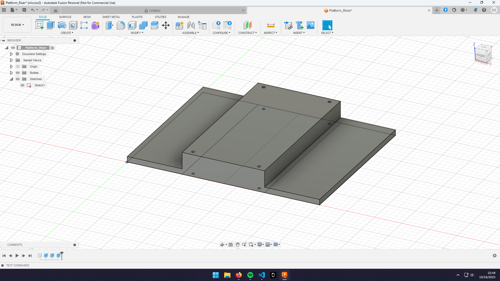

This is for the cad files.

## Journal
I did not count the time building the chassis kit.

### Thursday, October 16th | 30 minutes
Spent 30 minutes designing a simple riser so that I can fit more stuff on the tank. There is not enough room otherwise. This is mainly so I can start installing everything tmrw, once I have an idea of where things fit, I'll make a better version.

