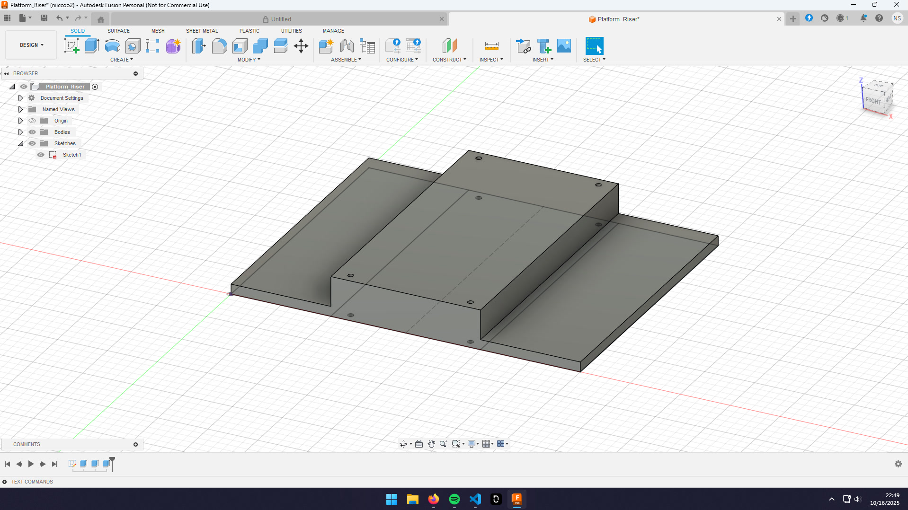
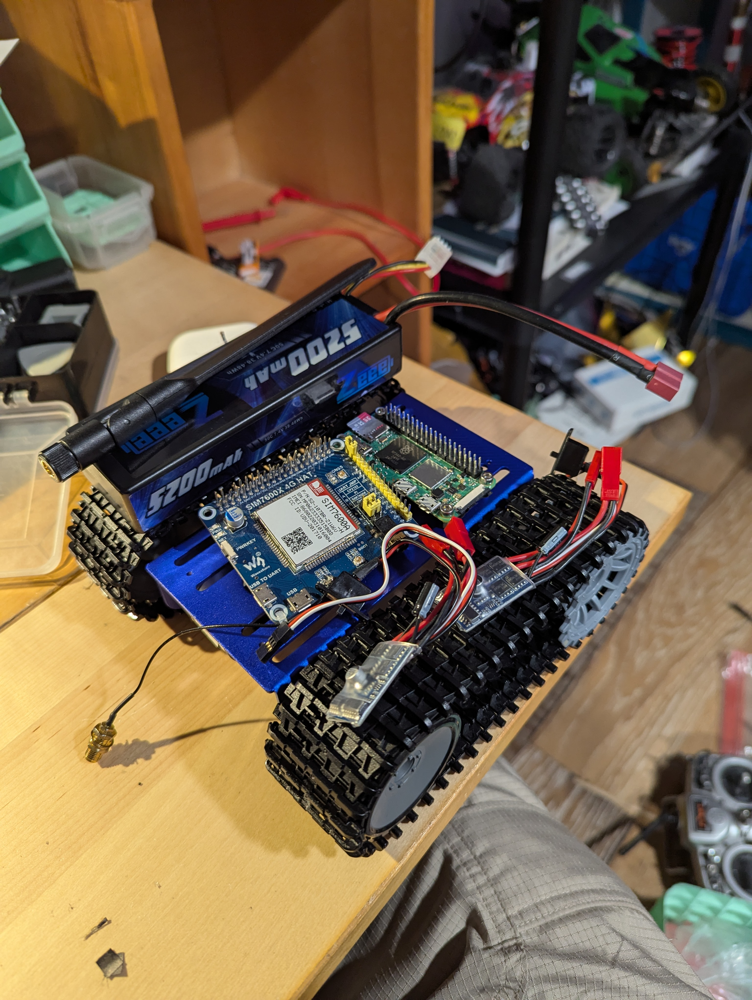
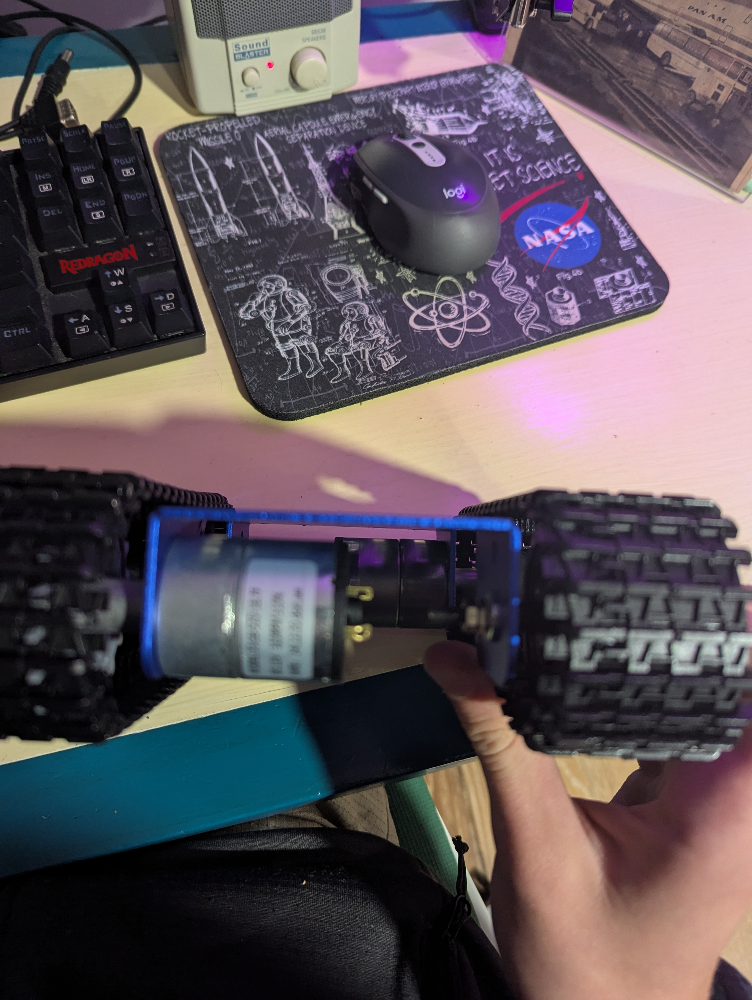
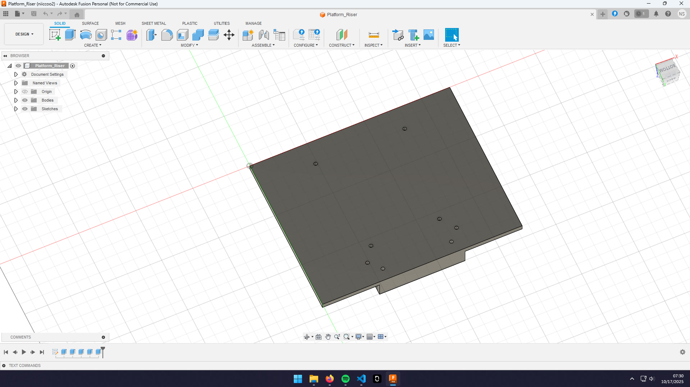
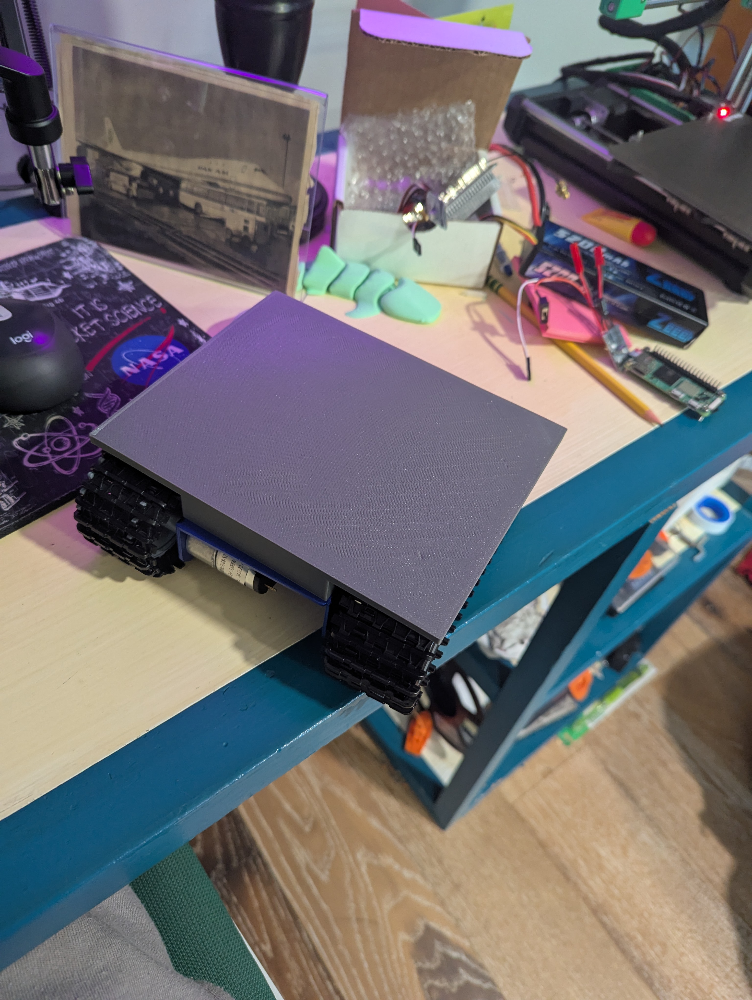

## Journal
I did not count the time building the chassis kit.

### Thursday, October 16th | 30 minutes
Spent 30 minutes designing a simple riser so that I can fit more stuff on the tank. There is not enough room otherwise. This is mainly so I can start installing everything tmrw, once I have an idea of where things fit, I'll make a better version.

### Friday, October 17th | 30 minutes
Tested V1 of the riser. It covered the tracks fine, but I made the screw holes too small and mismeasured where the holes in the chassis are. I spent 30 making V2 with the following improvements.
- Fix size of screw holes
- Fix chassis mountiung hole locations
- Add holes for mounting RPI Zero
- Add holes to ziptie batterys on the edge

