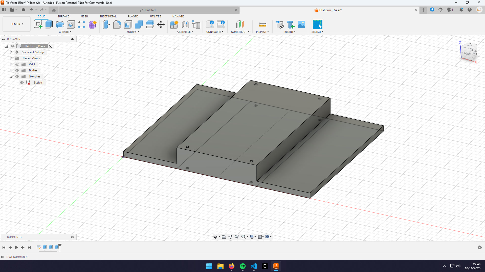
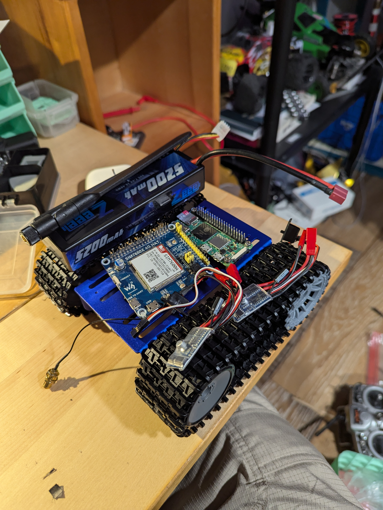
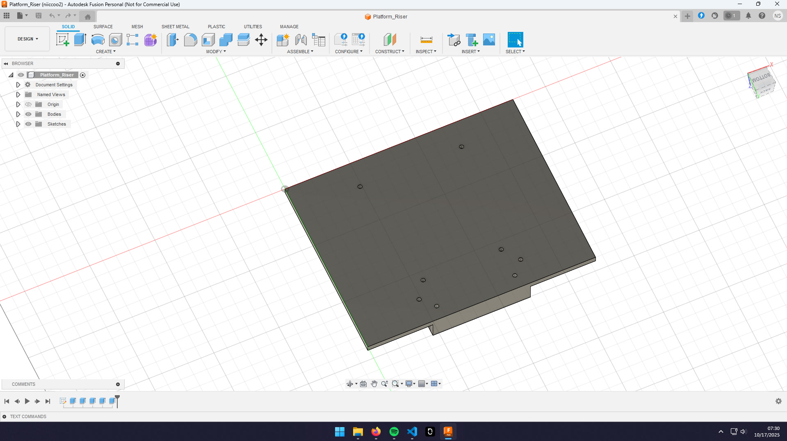
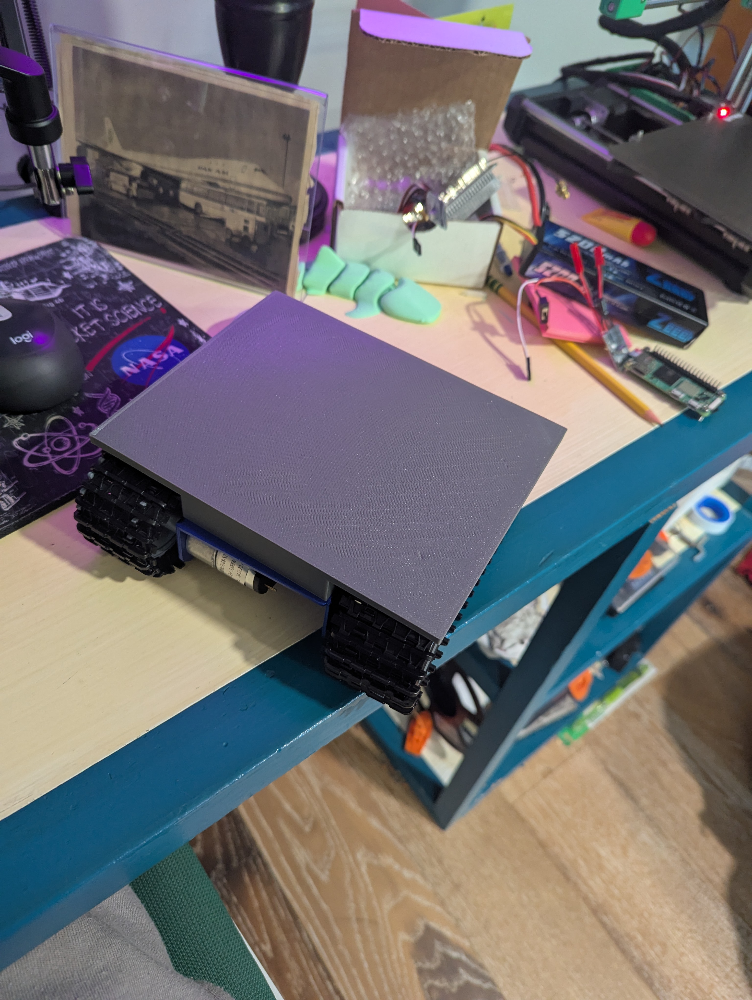
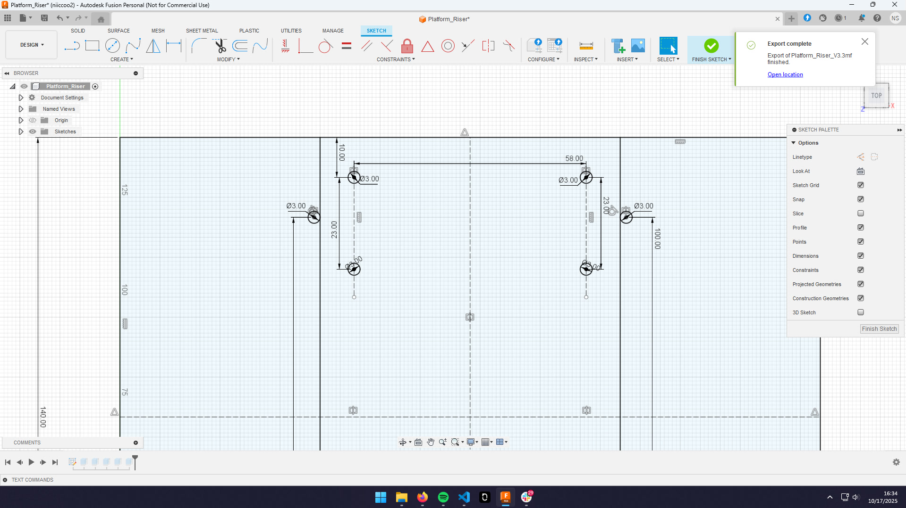
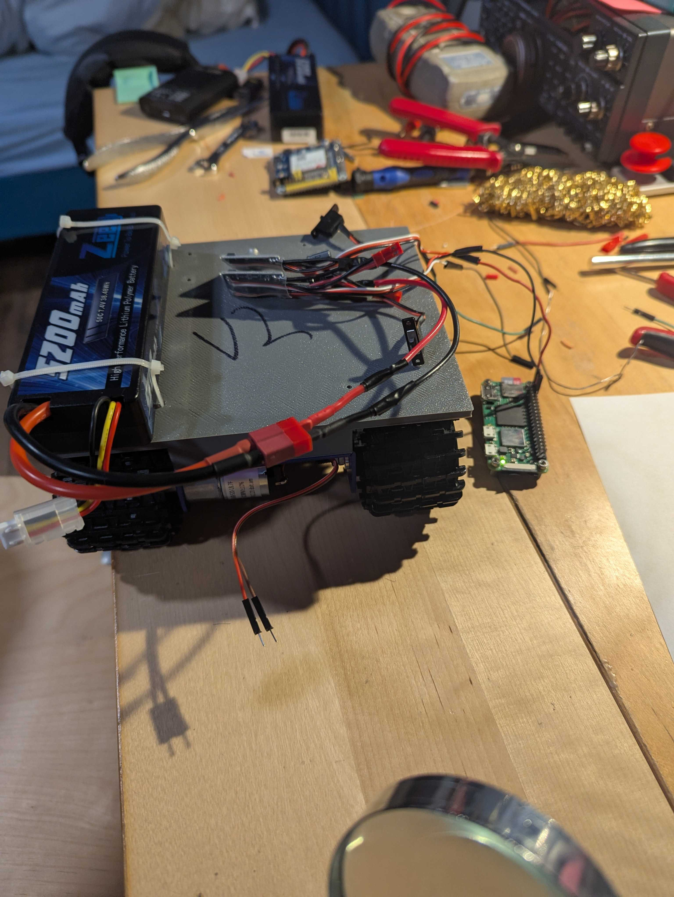
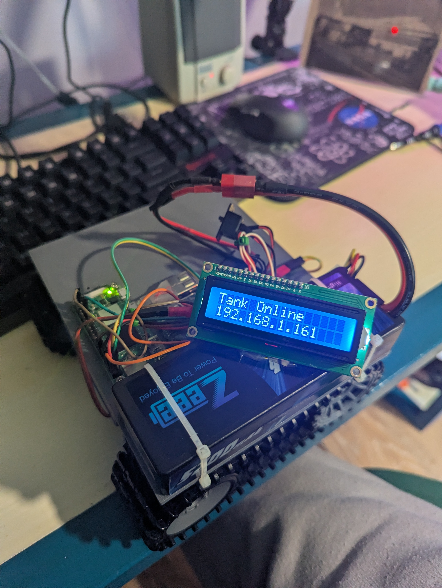
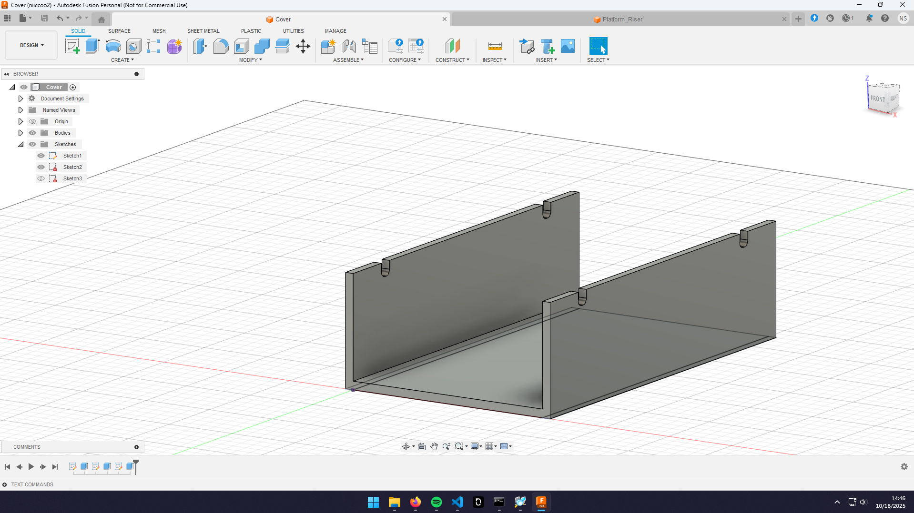
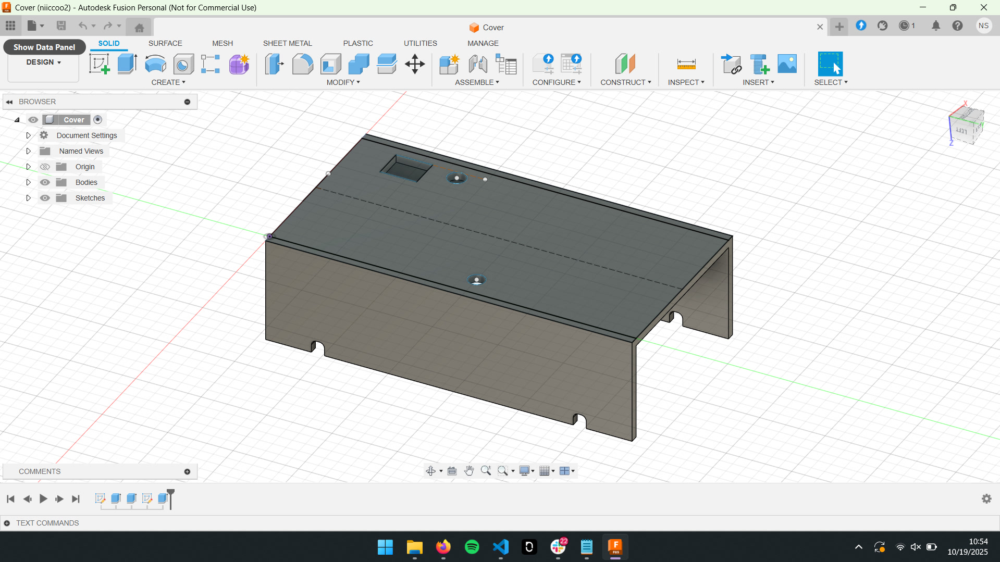
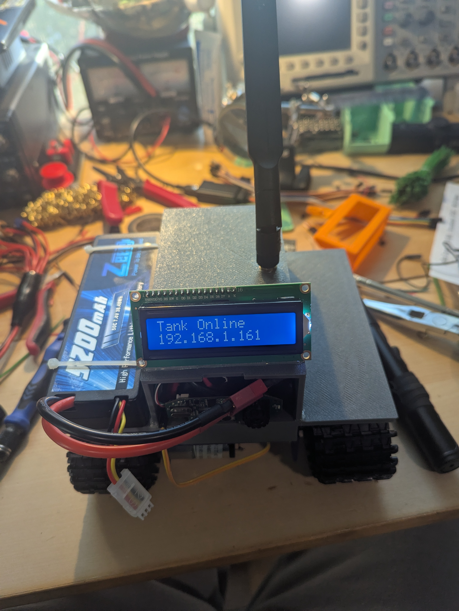

## Journal
I did not count the time building the chassis kit.

### Thursday, October 16th | 30 minutes
Spent 30 minutes designing a simple riser so that I can fit more stuff on the tank. There is not enough room otherwise. This is mainly so I can start installing everything tmrw, once I have an idea of where things fit, I'll make a better version.

### Friday, October 17th | 4 hours
#### 07:00 | 30 minutes
Tested V1 of the riser. It covered the tracks fine, but I made the screw holes too small and mismeasured where the holes in the chassis are. I spent 30 making V2 with the following improvements.
- Fix size of screw holes
- Fix chassis mountiung hole locations
- Add holes for mounting RPI Zero
- Add holes to ziptie batterys on the edge

#### 16:00 | 30 minutes
Took apart the car and tracks to test V2 of the riser. The mounting holes distance to edge rn is good but apparently I misread the design sheet and made them to far apart. So I made a quick edit and started V3 on the printer.

#### 18:30 | 1 hour
Soldered a bunch of cables to the motor controllers and did first boot of pi from the tank battery. V3 of the riser is almost done printing. Going to start researching and writing code to make the motors spin!

#### 20:00 | 2 hours
Got the car to drive. But one of the free wheels is locking up, v3 of the riser but finished printing so I'll fix the wheel as I put the new version on. Put V3 of riser on tank. ALL SCREWS LINE UP!!

### Saturday, October 18th | 3.25 hours
#### 10:00 | 1 hour
Added a lcd screen that displays the IP because it kept changing ip. Also wrote code so that it auto displays on boot. Right now its seprate from main.py but at some point I will find a way to intigrate once I feel safe having it auto run main.py.

#### 14:30 | 15 minutes
Seeing how quickly I'm running out of room, I designed a cover for the pi, modem and camera so that I could mount more stuff like the screen, antennas, lights, and other goodies.

#### 20:25 | 30 minutes
Tested the cover and made some changes and printed v2. Still going to use hot glue to mount until I redo the riser.
Changes:
- Make total width 75mm instead of 3+75+3
- Add hole for power switches
- Add hole for SMA connector
- Add hole for LCD cables
- Add notch for camera

#### 21:40 | Not logging this time
Just spent 20 minutes figuring out why code was not working, but it was because I was never pulling changes to the tank... Also forgot that a vertical cam makes a vertical stream so going to put it back into original positon and remove the notch in the cover for it. Not a big deal so not printing V3 of cover yet.

#### 22:00 | 1.5 hours
Worked on the website and debugged the twitches. I want to make the website look nicer but I'm going to get some more features working first.
Website changes:
- Embed video stream
- Add connection status
- Add var to enable or disable cam (Added, but did not add a ui switch yet)
- Add ping
- Redo layout

### Sunday, October 19th | 2 hours
#### 08:00 | 30 minutes
Installed the modem and V2 of the cover.

#### 11:00 | 30 minutes
Wrote some quick code that will set the motors to 0 if it has not gotten a cmd in the last 1000ms. To be tested.
#### 20:30 | 30 minutes
Used `sudo nmtui` to set up multiple wifi networks. Then used `nmcli c mod "mypreferred" conn.autoconnect-priority 10` to set priority; higher number is higher priority. The modem has not been set up yet but thats the idea. I'll set up the modem once I have the tank working better on wifi.
| Network Name | Priority |
| ------------ | -------- |
| home1        | 10       |
| home2        | 10       |
| phone        | 20       |
| cell modem   | 30       |
#### 21:00 | 30 minutes
Spend a bit trying to debug why it is sending tiny bit of power to the motors whenever we read from camera. Seems to be either power related or USB interferince. Tmrw I'll look at the pwm signals to check how they look, as well as calculate the total power everything is drawing and the total the motor contolers can supply from the 5v rail. I think I'm pulling too much so might need a seprate buck converter.
### Monday, October 20th | 30 minutes
#### 07:20 | 30 minutes
Did some research on how much power everything draws. (Everything @ 5v). Each BEC provides 1A so 2A total. A lot of the items did not have stright answers so I'll measure myself at some point. The Pi claims it uses 2.5A but thats crazy so I'll say 1A. Next I'm going to look at the pwm signals to see if there is anything weird about them.
| Device | Power |
| ------ | ----- |
| RPI    | 1A    |
| Modem  | 2A    |
| Camera | 200mA?|
| LCD    | 22mA? |
| Total  | 3.2A  |

I think all the weird issues are becasue we are drawing too much power from the ESC BEC's. So I'm going to find a better buck comverter to use. In the mean time I'm going to work on the website or something that is not broken.

### Tuesday, October 21st | 1 hour
#### 20:00 | 1 hour
Worked on the website.
Changes:
- Add background
- Fix setting div's
- Add switch for cam on / off (Still working on looks)

### Wendesday, October 22nd | 1 hour
#### 20:00 | 1 hour
Found a buck converter and did some testing to get it ready to be used in the tank. Also started thinking and calculating the correct size fuse to add to the battery.

### Friday, October 24th | 2 hours
#### 17:40 | 30 minutes
Designed V4 of riser. Made the whole thing widers and added holes for the cover to screw into.

### 20:00 | 1.5 hours
Designed V3 of the cover. Main change were the screw holes so I don't need to use hot glue each time I want to mount it. Tmrw morning I'm going to finish some tests on the new buck converter and mount it, along with a fuse and main power switch into the tank. Then mount new cover and see if it fixed anything.
Changes:
- Add hole for GPS SMA connector.
- Add new walls
- Add hole for batt cord
- New hole for new power switch
- GPS and CELL labels
- Screw mounts

### Saturday, October 25th | 1.5 hours
#### 10:00 | 1 hour
Assembled and attached the new riser. I made the holes for the M3 screws a bit too big (3.4mm from 3mm), so that was a mess. Right now you have to take the whole tank apart to replace the riser, not the best, so I might fix that in a new version.
#### 12:00 | 30 minutes
Kept testing the buck converter (forshadowing, it was broken), it was not making sense why the voltage would colapse as soon as a load was added (24 Ohm power resistors).

### Sunday, October 26th | 2 hours
#### 10:00 | 1 hour
Found out that the buck converter I was trying to use was damaged. After I found that out and got some new ones, everything was making much more sense. The converter was able to buck a 6v input to 5v out. That is better than the specs but thats good. It was also able to power some 24 Ohm power resistors. I=V/R 5/24=0.204 ish Amps.
#### 22:00 | 1 hour
Soldered the new buck converter, fuse, and power switch into the tank. Now I need to fit this mess into the new cover I printed... After being powered on for a few secs, something starts making a weird noise, I'll look into it in the morning.

### Wendsday, October 29th |
#### 20:00 | 

## CAD designs
### Riser
#### V3
- Holes to mount to chasis
- Holes for RPI
- Holes for battery zipties
#### V4
- Screw holes to mount to chasis
- Screw holes for RPI
- Holes for battery zipties
- Screw holes for cover
### Cover
#### V1
- Indents for zipties
#### V2
- Indents for zipties
- Hole for switches
- Indent for camera mount
- Hole for cell SMA
- Hole for LCD cables
#### V3
- Indents for zipties
- Hole for switches + holes for switch screws
- Hole for cell SMA
- Hole for GPS SMA
- Hole for LCD cables
- Mounting holes to mount to riser