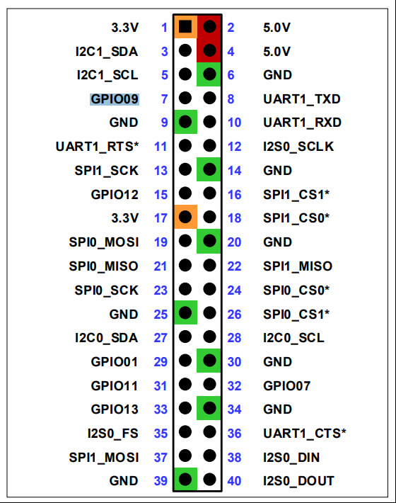

# Info

This is version 2 of my RC-Tank. It is no longer a tank but whatever. I created both versions for Hack Club [Moonshot](https://moonshot.hackclub.com).

The idea of this project was simple, I had a normal rc car with camera, but it coulden't even go around the block, so I wanted something that would have much better range. Thats where using a cell modem comes in. The main (and big) disadvantage with this is latency, you need < 1.5s or else it becomes very hard to drive. I learned a lot doing this project (not done though!), I spent a lot of time learning about motor contollers and reverse engineering some hoverboard ECS's so I could use the motors I had. The main thing I want to keep working on, is the latency over cell, hopefully I can get webRTC working also. After I have a working human controled rover, then I will use it as the testbed for many more projects such as AI vision control, and GPS waypoints.


# Setup

## Internet

### Install Tailscale

Go to [login.tailscale.com/admin/machines](https://login.tailscale.com/admin/machines) and follow instructions for new linux device.

Use this command to start it so ssh will work: `sudo tailscale up --reset --netfilter-mode=off --ssh`.

### Turn off wifi power saving

```shell
sudo iw dev wlP1p1s0 set power_save off
```

You might need to use something like `ifconfig -a` to find the right network interface.

### Add networks and set wifi priority

```shell
sudo nmtui
```

```shell
sudo nmcli c mod "mypreferred" conn.autoconnect-priority 10
```

to set priority; higher number is higher priority.

### Cmd to temp use wifi

```shell
sudo ip route del default via 192.168.1.1 dev wlan0
sudo ip route add default via 192.168.1.1 dev wlan0 metric 50
```

### Cmd to dissconnect from WiFi

```shell
sudo ip link set wlan0 down

sudo ip link set wlan0 up

```

## Jetson specific

### Configure GPIO for SPI

To use SPI on the GPIO pins, you must first run the Jetson-IO python script and enable SPI.

```shell
sudo /opt/nvidia/jetson-io/jetson-io.py
```

### Resize file system after copying from SD to SSD

```shell
sudo apt install cloud-utils
sudo growpart /dev/nvme0n1 1
sudo resize2fs /dev/nvme0n1p1
```

### Wiring



(Wire color is to just help me)

| Pin # | Purpose  | Item              | Wire Color |
| ----- | -------- | ----------------- | ---------- |
| 2     | 5V       | Compass Power     | Red        |
| 3     | I2C1_SDA | Compass Data      | Orange     |
| 5     | I2C1_SCL | Compass Data      | Brown      |
| 6     | GND      | ESC Serial Ground | Green      |
| 8     | UART1_TX | ESC UART RX       | Purple     |
| 9     | GND      | Compass Ground    | Black      |
| 10    | UART1_RX | ESC UART_TX       | Yellow     |
| 19    | SPI_0    | Lights Control    | Orange     |

## Website

You first need to directly go to one of the API endpoints to accept the self signed cert. _Remember that you have to use the :5000 port!_

## Custom TURN / STUN server

`sudo apt install coturn`

`sudo ufw allow 3478/udp`
`sudo ufw allow 3478/tcp`

Edit `/etc/turnserver.conf`

```conf
listening-port=3478
listening-ip=<YOUR_PUBLIC_IP>
external-ip=<YOUR_PUBLIC_IP>
realm=rc-tank
user=tank:tankpass
lt-cred-mech
fingerprint
```

`sudo systemctl restart coturn`
`sudo systemctl enable coturn`

Set the correct IP inside of `webrtc.py` and `webrtc.ts`

# Running the tank

`sudo JETSON_MODEL_NAME=JETSON_ORIN_NANO python3 ./main.py`
