Supported by [RTKdata](https://rtkdata.com/)


# Ships

_Wondering what a ship is? Watch [this](https://vimeo.com/1111478391) video! Basically, a ship is when you make your project experiancable by others. In this case, that is writing a README about the project and adding some videos so people can see what it is!_

### Version 4 BETA

This is a pretty small version, only 35 hours more than V3. This includes a bit of testing on the old frame, and then the start of designing the new frame. The new frame has been super fun to design but also super hard. Most of this is because all I knew was that I wanted a new frame, nothing else, but also because I didn't really know how to use Fusion. I will say that I learned a lot, and I am ready to finish up the frame. I'm hoping that this is over half of the new frame done, but it might end up taking a lot longer.

Features of new frame worked on for this ship:

- Main body
  - Figuring out how to connect all the aluminum was hard
- Start of the drivetrain

That doesn't sound like a lot, but it really is, especially when you don't know CAD.

CAD file for this ship can be found at `/CAD/V4/ships/V4b.3mf`.

Go look at the build journal (its pretty long! Scroll until you find V4, this ship was on SEP 5): [here!](./JOURNAL.md)

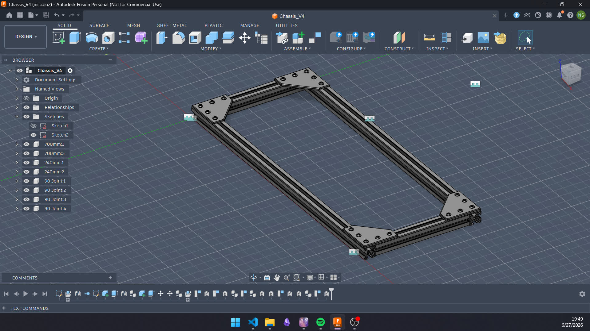
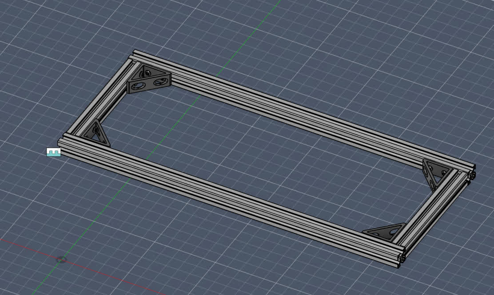
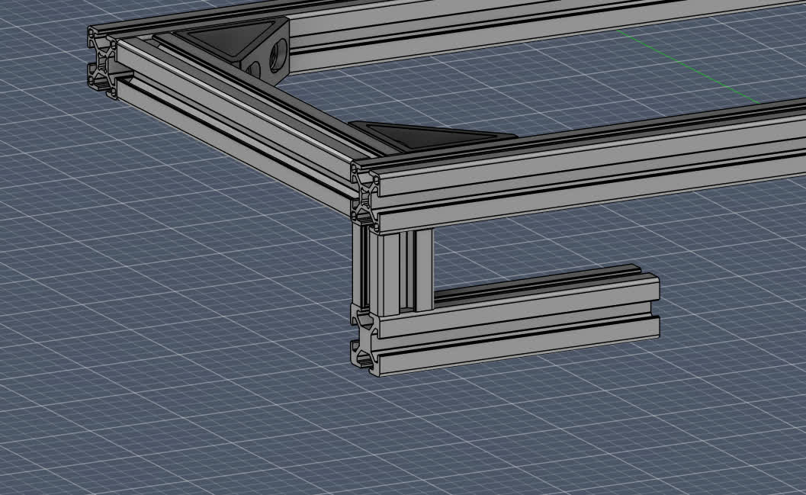
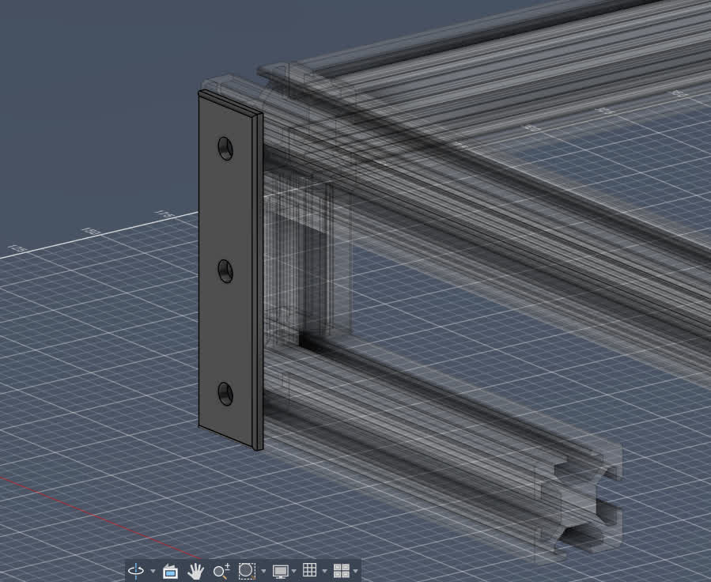
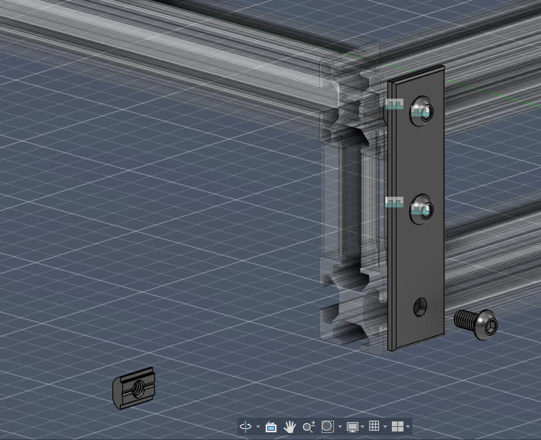
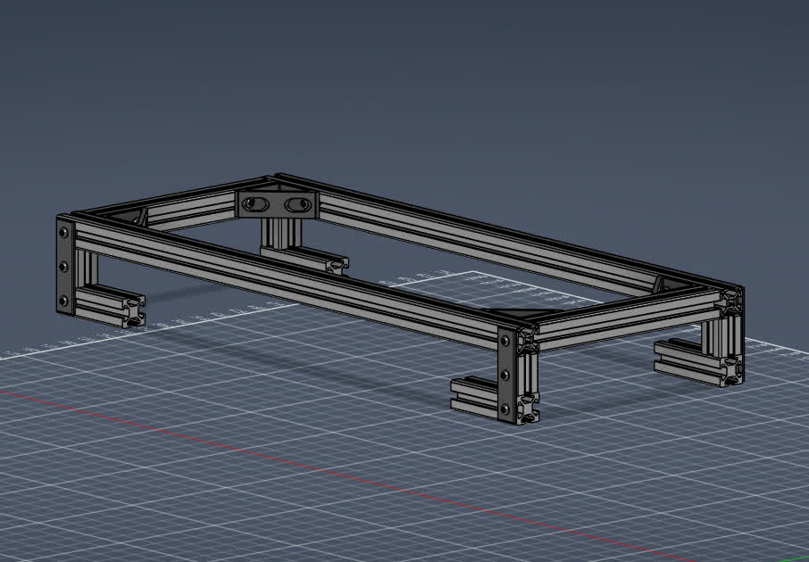
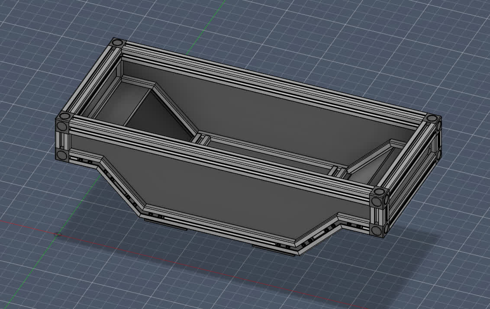
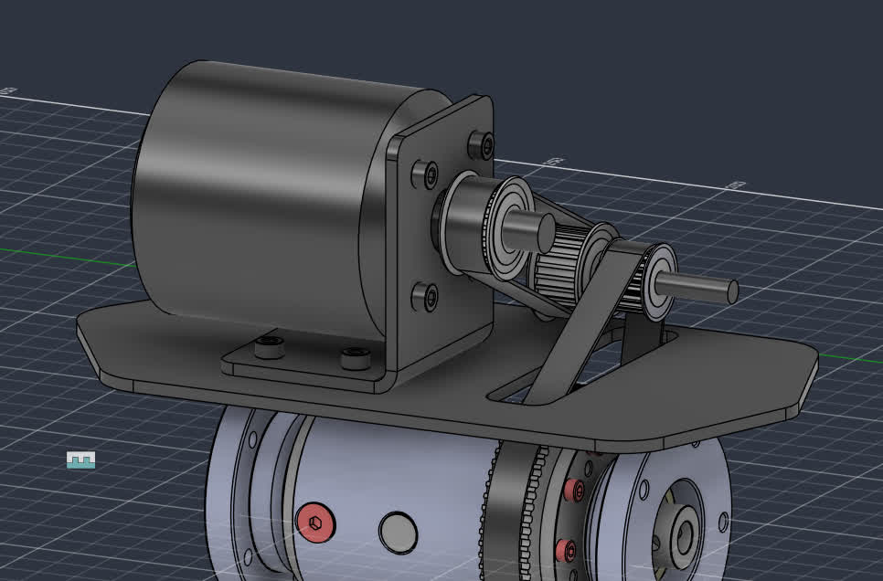
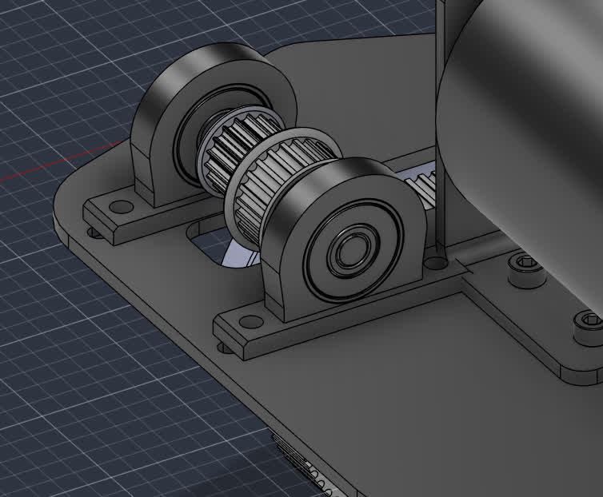
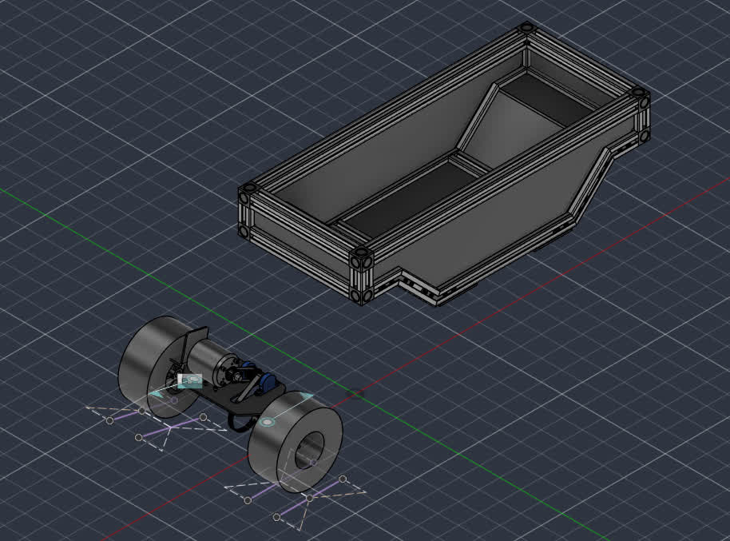

## Version 3

Features:

- Overall:
  - Low latency human driving using cellular
  - Waypoint driving using RTK GPS (under 30mm accuracy)
- Vehicle:
  - Hoverboard motors (very high tourque)
  - Neopixels for headlights and direction lights (red and green)
  - Camera for driving
  - GoPro monuts for videos (not needed to drive, only for extra video)
  - Handles because it weighs 35lbs (around 15kg)
  - Tech specs:
    - Nvidia Jetson Orin Nano
    - SIM7600 cell modem
    - SparkFun GPS-RTK2 Board
    - Hoverboard ECS's
    - 16Ah 4S LiPo battery
- Website:
  - Live video from tank (under 100ms control loop)
  - Live telemetry from tank:
    - Location
    - RTK GPS status
    - Battery voltage
    - Ping
    - Heading
  - Map:
    - View live location of tank
    - Create waypoint routes
    - Send routes to tank
    - Download and upload routes as JSON files
  - Tank settings:
    - Car mode (off lets you control each wheel by itself)
    - Lights
    - FrSky mode (for nicer controlers)
    - Self driving toggle
    - Video toggle
    - Refresh rate setting
  - Go check out the website at [rc.nicosmith.net](https://rc.nicosmith.net)! (Enter anything into text box and click connect)

Version 3 of this project has been based around adding waypoint following capabilities to the tank. There should also be version 3.5 coming out soon which will add ML features, such as staying on sidewalk and avoiding humans. This version has taken a while, but it is well worth it. The project as a whole has taken over 110 hours over 112 days (see, it really is a little bit every day). I redid the entire website UI, redid entire tank-side python software, and added waypoint following code. I have learned a lot about everything, from how much of a pain CSS can be, to how WebRTC doesn't follow system routing priorities, to how people are jerks and will steal stuff. Here are some awesome pictures and videos!

Go look at the build journal (its pretty long): [here!](./JOURNAL.md)

[Videos!](https://drive.proton.me/urls/YN5Q618FJM#a7Ycw6LDcv0I)


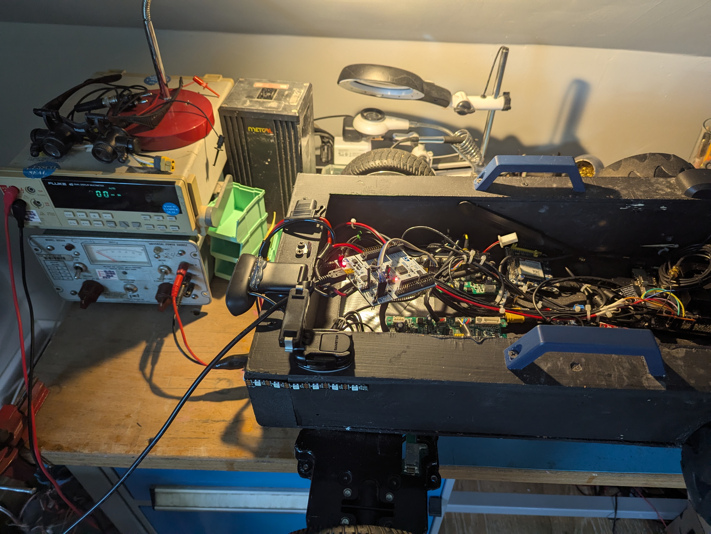
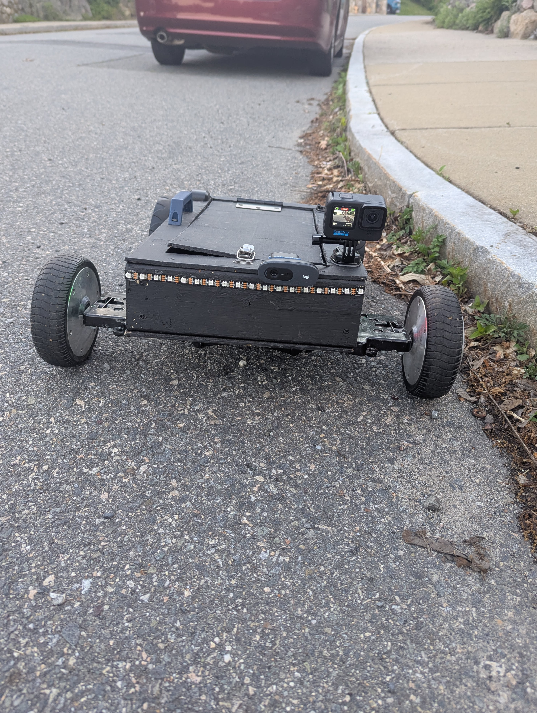
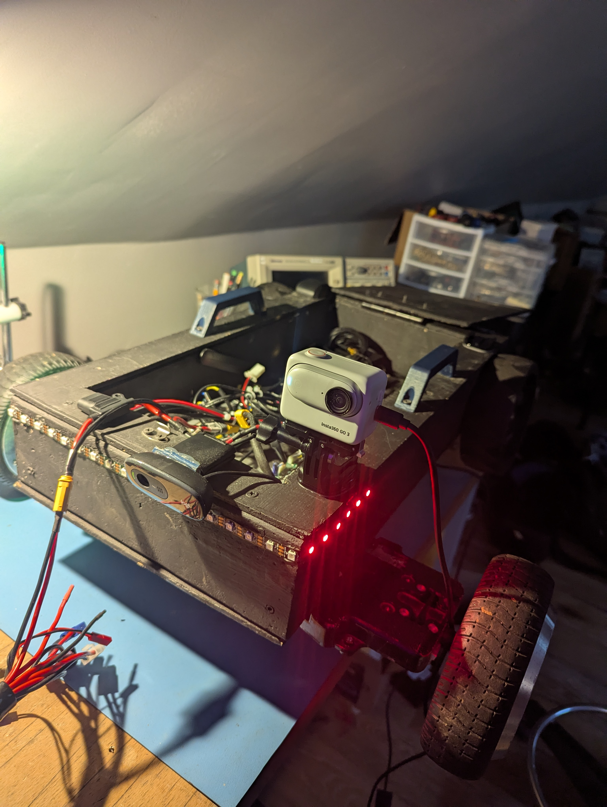
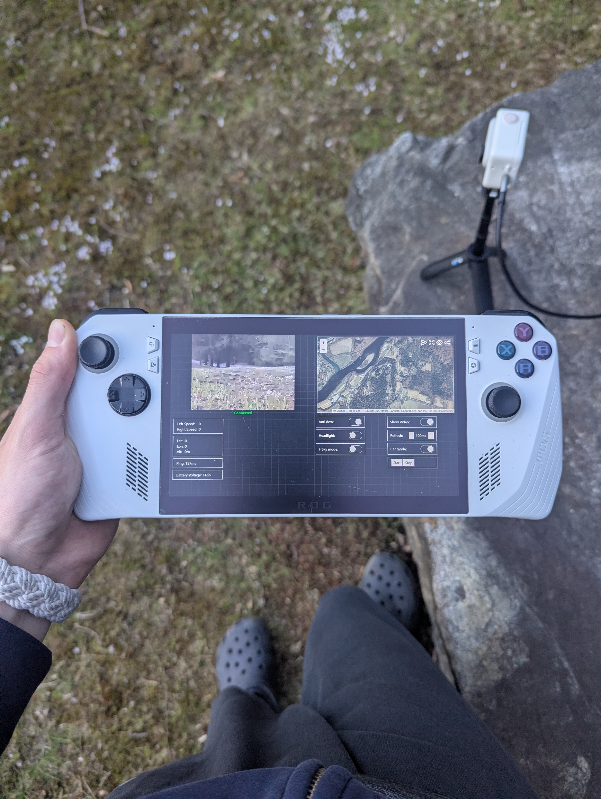

## Versions 1 & 2

This is version 2 of my RC-Tank. It is no longer a tank but whatever. I created both versions 1 and 2 for Hack Club [Moonshot](https://moonshot.hackclub.com).

The idea of this project was simple, I had a normal rc car with camera, but it coulden't even go around the block, so I wanted something that would have much better range. Thats where using a cell modem comes in. The main (and big) disadvantage with this is latency, you need < 1.5s or else it becomes very hard to drive. I learned a lot doing this project (not done though!), I spent a lot of time learning about motor contollers and reverse engineering some hoverboard ECS's so I could use the motors I had. The main thing I want to keep working on, is the latency over cell, hopefully I can get webRTC working also. After I have a working human controled rover, then I will use it as the testbed for many more projects such as AI vision control, and GPS waypoints.


# Setup

## Internet

### Install Tailscale

Go to [login.tailscale.com/admin/machines](https://login.tailscale.com/admin/machines) and follow instructions for new linux device.

Use this command to start it so ssh will work: `sudo tailscale up --reset --netfilter-mode=off --ssh`.

### Turn off wifi power saving

```shell
sudo iw dev wlP1p1s0 set power_save off
```

You might need to use something like `ifconfig -a` to find the right network interface.

### Add networks and set wifi priority

```shell
sudo nmtui
```

```shell
sudo nmcli c mod "mypreferred" conn.autoconnect-priority 10
```

to set priority; higher number is higher priority.

### Cmd to temp use wifi

```shell
sudo ip route del default via 192.168.1.1 dev wlan0
sudo ip route add default via 192.168.1.1 dev wlan0 metric 50
```

### Cmd to dissconnect from WiFi

```shell
sudo ip link set wlan0 down

sudo ip link set wlan0 up

```

## Jetson specific

### Configure GPIO for SPI

To use SPI on the GPIO pins, you must first run the Jetson-IO python script and enable SPI1 (no idea why you need SPI1 for SPI0).

```shell
sudo /opt/nvidia/jetson-io/jetson-io.py
```

### Resize file system after copying from SD to SSD

```shell
sudo apt install cloud-utils
sudo growpart /dev/nvme0n1 1
sudo resize2fs /dev/nvme0n1p1
```

### Wiring

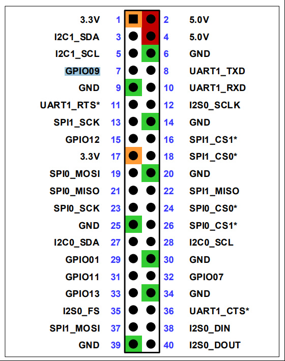

(Wire color is to just help me)

| Pin # | Purpose  | Item              | Wire Color |
| ----- | -------- | ----------------- | ---------- |
| 2     | 5V       | Compass Power     | Red        |
| 3     | I2C1_SDA | Compass Data      | Orange     |
| 5     | I2C1_SCL | Compass Data      | Brown      |
| 6     | GND      | ESC Serial Ground | Green      |
| 8     | UART1_TX | ESC UART RX       | Purple     |
| 9     | GND      | Compass Ground    | Black      |
| 10    | UART1_RX | ESC UART_TX       | Yellow     |
| 19    | SPI_0    | Lights Control    | Orange     |

## Website

You first need to directly go to one of the API endpoints to accept the self signed cert. _Remember that you have to use the :5000 port!_

## Custom TURN / STUN server

`sudo apt install coturn`

`sudo ufw allow 3478/udp`
`sudo ufw allow 3478/tcp`
`sudo ufw allow 50000:50050/udp`

Edit `/etc/turnserver.conf`

```conf
listening-port=3478
listening-ip=<YOUR_PUBLIC_IP>
external-ip=<YOUR_PUBLIC_IP>
realm=rc-tank
user=tank:tankpass
lt-cred-mech
fingerprint

min-port=50000
max-port=50050
```

`sudo systemctl restart coturn`
`sudo systemctl enable coturn`

Set the correct IP inside of `webrtc.py` and `webrtc.ts`

# Running the tank

`sudo JETSON_MODEL_NAME=JETSON_ORIN_NANO python3 ./main.py`
