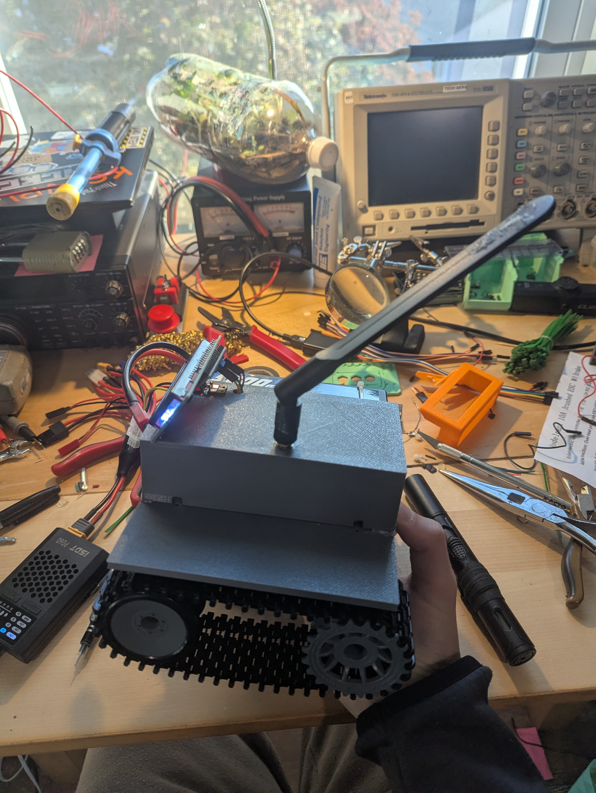

## Journal
I did not count the time building the chassis kit.

### Thursday, October 16th | 30 minutes
Spent 30 minutes designing a simple riser so that I can fit more stuff on the tank. There is not enough room otherwise. This is mainly so I can start installing everything tmrw, once I have an idea of where things fit, I'll make a better version.

### Friday, October 17th | 4 hours
#### 07:00 | 30 minutes
Tested V1 of the riser. It covered the tracks fine, but I made the screw holes too small and mismeasured where the holes in the chassis are. I spent 30 making V2 with the following improvements.
- Fix size of screw holes
- Fix chassis mountiung hole locations
- Add holes for mounting RPI Zero
- Add holes to ziptie batterys on the edge

#### 16:00 | 30 minutes
Took apart the car and tracks to test V2 of the riser. The mounting holes distance to edge rn is good but apparently I misread the design sheet and made them to far apart. So I made a quick edit and started V3 on the printer.

#### 18:30 | 1 hour
Soldered a bunch of cables to the motor controllers and did first boot of pi from the tank battery. V3 of the riser is almost done printing. Going to start researching and writing code to make the motors spin!

#### 20:00 | 2 hours
Got the car to drive. But one of the free wheels is locking up, v3 of the riser but finished printing so I'll fix the wheel as I put the new version on. Put V3 of riser on tank. ALL SCREWS LINE UP!!

### Saturday, October 18th | 3.25 hours
#### 10:00 | 1 hour
Added a lcd screen that displays the IP because it kept changing ip. Also wrote code so that it auto displays on boot. Right now its seprate from main.py but at some point I will find a way to intigrate once I feel safe having it auto run main.py.

#### 14:30 | 15 minutes
Seeing how quickly I'm running out of room, I designed a cover for the pi, modem and camera so that I could mount more stuff like the screen, antennas, lights, and other goodies.

#### 20:25 | 30 minutes
Tested the cover and made some changes and printed v2. Still going to use hot glue to mount until I redo the riser.
Changes:
- Make total width 75mm instead of 3+75+3
- Add hole for power switches
- Add hole for SMA connector
- Add hole for LCD cables
- Add notch for camera

#### 21:40 | Not logging this time
Just spent 20 minutes figuring out why code was not working, but it was because I was never pulling changes to the tank... Also forgot that a vertical cam makes a vertical stream so going to put it back into original positon and remove the notch in the cover for it. Not a big deal so not printing V3 of cover yet.

#### 22:00 | 1.5 hours
Worked on the website and debugged the twitches. I want to make the website look nicer but I'm going to get some more features working first.
Website changes:
- Embed video stream
- Add connection status
- Add var to enable or disable cam (Added, but did not add a ui switch yet)
- Add ping
- Redo layout

### Sunday, October 19th | x hours
#### 08:00 | 30 minutes
Installed the modem and V2 of the cover.

## CAD designs
### Riser
#### V3
- Holes to mount to chasis
- Holes for RPI
- Holes for battery zipties
#### V4
- Screw holes to mount to chasis
- Screw holes for RPI
- Holes for battery zipties
- Screw holes for cover
- Holes for motor cables
### Cover
#### V1
- Indents for zipties
#### V2
- Indents for zipties
- Hole for switches
- Indent for camera mount
- Hole for cell SMA
- Hole for LCD cables
#### V3 (To be designed)
- Indents for zipties
- Hole for switches + holes for switch screws
- Hole for cell SMA
- Hole for GPS SMA
- Hole for LCD cables
- Mounting method for LCD?
- Mounting holes to mount to riser?