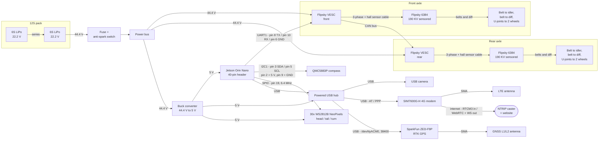

# Wiring Diagram — V4

How everything in the [BOM](./BOM.md) wires together on **V4**. V4 runs a 12S pack into two VESCs
driving two Flipsky BLDC motors — one per beam axle, belted to a differential. The compute and
sensing side (Jetson, RTK GPS, compass, camera, modem, lights) carries over from V3 unchanged.

Arrows with a voltage are power. Arrows with a protocol are data.

## Notes

- **The 5 V rail needs its own converter.** The stack pulls ~3.2 A at 5 V (Jetson ~1 A, modem ~2 A,
  camera ~200 mA). On V3 I tried to run it off the ESC BECs, which only gave 1 A each, and it caused
  a long run of bugs that all looked like software problems. Don't repeat that.
- **12S needs an anti-spark switch,** not a bare switch — 44.4 V into the VESC caps will weld a
  plain contact.
- **One VESC is the master.** The Jetson talks UART to the front VESC only; the front VESC forwards
  to the rear over CAN. Same idea as the V3 UART bus, one link from the host instead of two.
- **Motors are sensored,** so each one needs the hall sensor cable back to its VESC as well as the
  three phase wires. Without it low-speed torque is bad, which matters for a heavy rover.
- **SPI must be enabled first** or the lights silently do nothing: run
  `sudo /opt/nvidia/jetson-io/jetson-io.py` and enable SPI1 (yes, SPI1 — it shows up as
  `/dev/spidev0.0`).
- **The compass needs its ground.** It reads garbage rather than erroring if pin 9 is missing.
- **Antennas go outside the shell.** The frame is aluminium, so the GNSS and LTE antennas need SMA
  bulkheads through the top panel.

## Jetson pin assignments

Unchanged from V3, except pins 6/8/10 now go to the front VESC instead of the hoverboard ESC.

| Pin # | Purpose  | Item              | Wire Color |
| ----- | -------- | ----------------- | ---------- |
| 2     | 5V       | Compass Power     | Red        |
| 3     | I2C1_SDA | Compass Data      | Orange     |
| 5     | I2C1_SCL | Compass Data      | Brown      |
| 6     | GND      | VESC Serial Ground | Green     |
| 8     | UART1_TX | VESC UART RX      | Purple     |
| 9     | GND      | Compass Ground    | Black      |
| 10    | UART1_RX | VESC UART TX      | Yellow     |
| 19    | SPI_0    | Lights Control    | Orange     |
